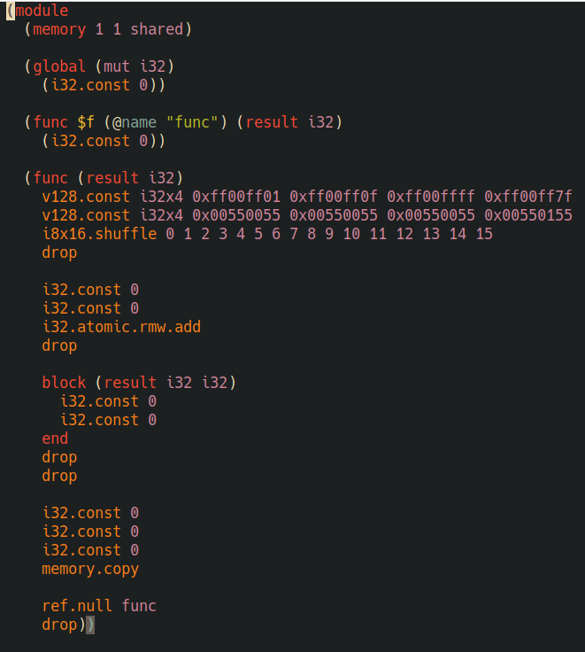

# Webassembly text format major modes using tree-sitter

[](https://www.gnu.org/licenses/gpl-3.0)

This package is compatible with and was tested against the tree-sitter grammar
for Wat/Wast found at https://github.com/wasm-lsp/tree-sitter-wasm.

It provides indentation, font-locking, imenu, and navigation support for Wat and
Wast buffers.



## Installing

Emacs 29.1 or above with tree-sitter support is required. 

Tree-sitter starter guide: https://git.savannah.gnu.org/cgit/emacs.git/tree/admin/notes/tree-sitter/starter-guide?h=emacs-29

### Install tree-sitter parsers for wat/wasm

To install the wat/wasm grammar libraries, add the sources to
`treesit-language-source-alist`. 

```elisp
;; wat
(add-to-list
 'treesit-language-source-alist
 '(wat "https://github.com/wasm-lsp/tree-sitter-wasm" nil "wat/src"))
;; wast
(add-to-list
 'treesit-language-source-alist
 '(wast "https://github.com/wasm-lsp/tree-sitter-wasm" nil "wast/src"))
```

Then run `M-x treesit-install-language-grammar` and select `wat`/`wast` to install the
shared libraries.

### Install wat-ts-mode.el from source

- Clone this repository
- Add the following to your emacs config

```elisp
(require "[cloned nverno/wat-ts-mode]/wat-ts-mode.el")
```

### Troubleshooting

If you get the following warning:

```
⛔ Warning (treesit): Cannot activate tree-sitter, because tree-sitter
library is not compiled with Emacs [2 times]
```

Then you do not have tree-sitter support for your emacs installation.

If you get the following warnings:
```
⛔ Warning (treesit): Cannot activate tree-sitter, because language grammar for wat is unavailable (not-found): (libtree-sitter-wat libtree-sitter-wat.so) No such file or directory
```

then the wat/wast grammar files are not properly installed on your system.
